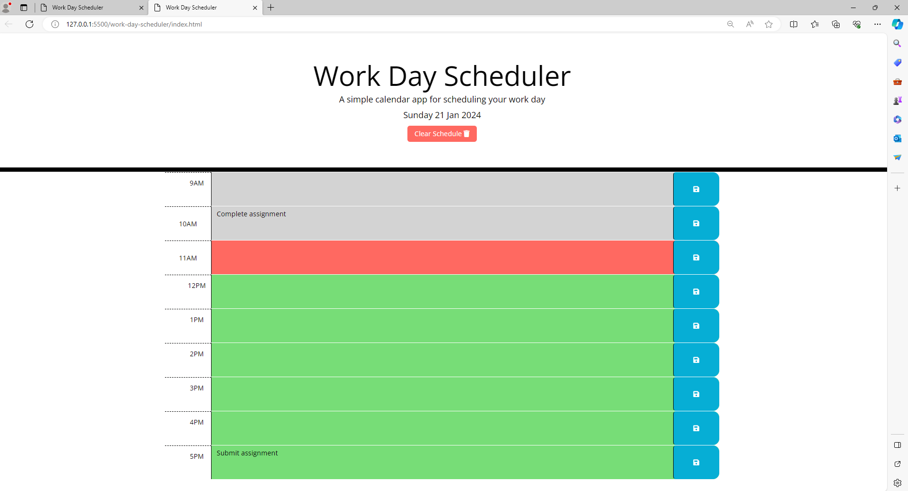

# work-day-scheduler

For this challenge I created a simple calendar application that allows a user to save events for each hour of the day.
The app runs in the browser features dynamically updated HTML and CSS powered by jQuery.

The app displays the current day which I used dayjs to input.

The app presents timeblocks for standard business hours which are color coded for past, present and future.

Users are able to add an event and save it, when the save button is clicked I ensured the data was saved to local storage and displayed each time the page was loaded.

I also created a clear button so if the user wanted to clear their planner/scheduler they can click this to do so.

